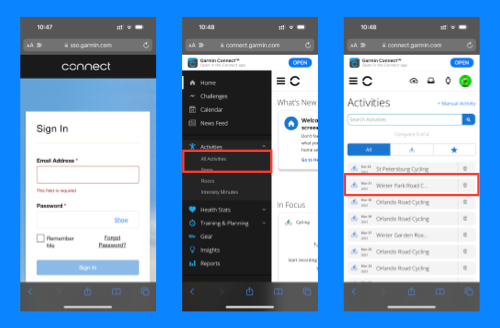
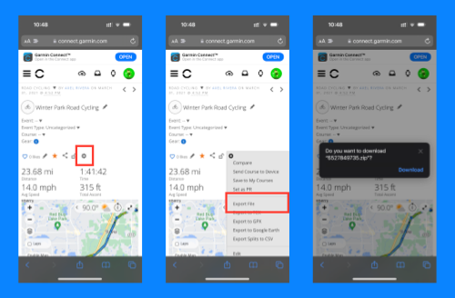
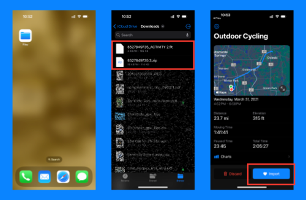

+++
title = 'Garmin: Download FIT File'
disableShare = true
+++

Follow these steps to download a FIT file from Garmin Connect's website.

Login to [connect.garmin.com]("https://connect.garmin.com") from Safari.

**Note:** The Garmin Connect iOS app may open after login. You may want to come back to Safari and manually enter the website again (connect.garmin.com).

## Step 1: Download FIT File

1. Go to "Activities"
2. Open the activity with the Route you want to download.
3. Look for a "Gear" button on the left menu and tap it.
4. Select "Export File" option
5. Tap on "Download" button
6. The file will be saved to the "Downloads" folder in your iCloud Drive on the Files app.

## Step 2: Open FIT File with Files App

1. Open the Files app
2. Go to "Browse -> iCloud Drive -> Downloads"
3. Look for workout file (name should be a ZIP file with multiple numbers)
4. Tap on the ZIP file to decompress it
5. Tap on the decompressed FIT file (this should open the Ride Import app and the workout)
6. Review the workout and tap the "Import" button

## Screenshots

