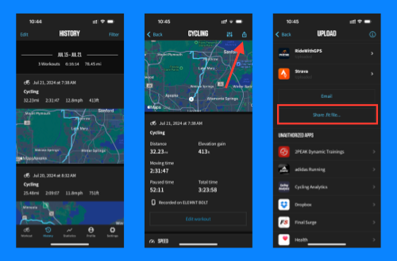
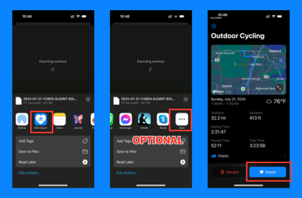

+++
title = 'Wahoo: Download FIT File'
disableShare = true
+++

Follow these steps to download a FIT file from the Wahoo ELEMNT Companion iOS app.

## Open FIT file from Wahoo's iOS App

1. Open the Wahoo ELEMNT app on your iPhone
2. Go to "History" and select a Workout
3. Tap on the "Actions" button on the top right of the screen
4. Tap on "Share .fit file" button
5. Look for "Ride Import" icon (you may have to swipe to the right and tap on the "More" button if not visible)
6. Tap on "Ride Import" icon (this should open the Ride Import app)
7. Review the workout and tap on the "Import" button

## Screenshots

